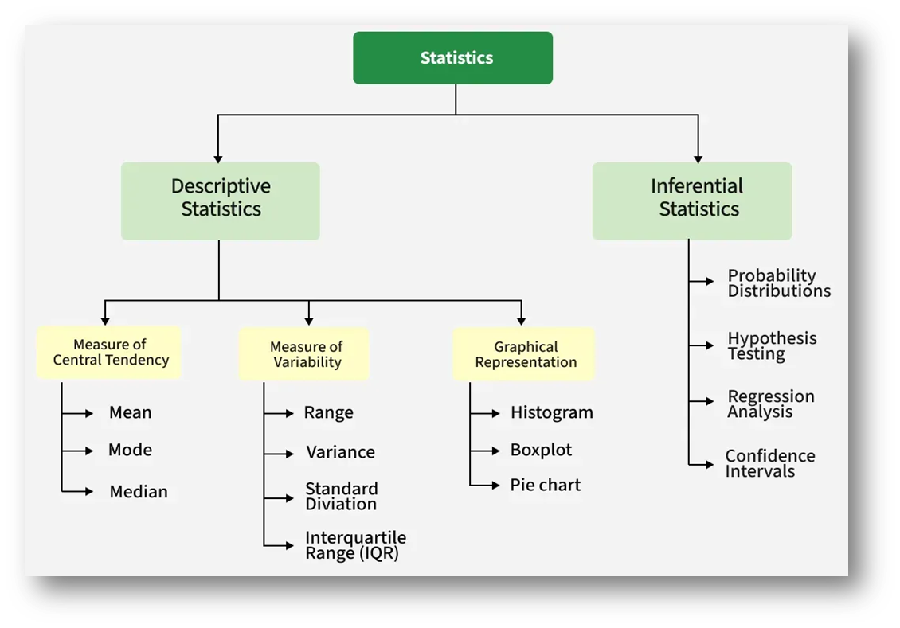
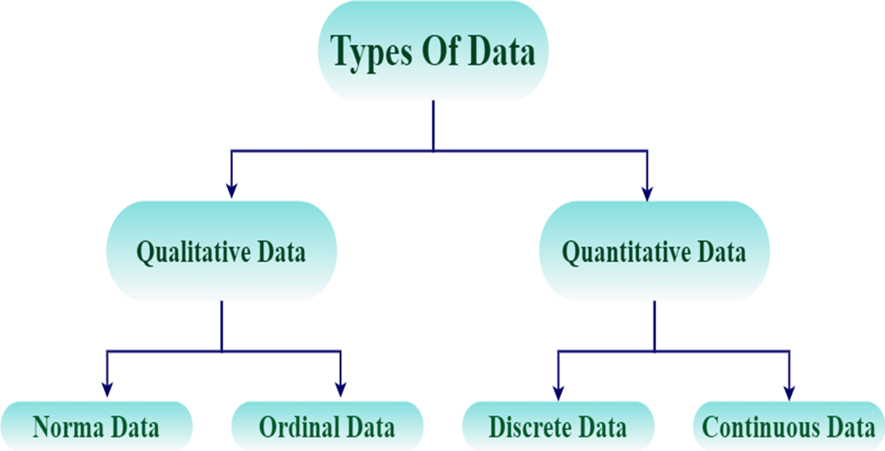

## Introduction to Statistics
Statistics is the science of collecting, analyzing, interpreting, and presenting data to make sense of the world. It helps us understand patterns, make decisions, and predict future outcomes based on information.
Imagine you run a small ice cream shop. Every day, you sell different flavors: chocolate, vanilla, strawberry. At the end of the week, you want to know:
- Which flavor is most popular?
- How many ice creams do you sell on average each day?
- Are there days when sales were unusually low or high?

Without statistics, you’d be guessing. With statistics, you can summarize your sales data, find patterns, and make smarter decisions like ordering more chocolate on hot days or running promotions on slow days.
### Example Table of Daily Ice Cream Sales:

| Day       | Chocolate | Vanilla | Strawberry | Total |
|-----------|-----------|---------|------------|-------|
| Monday    | 30        | 20      | 10         | 60    |
| Tuesday   | 25        | 15      | 20         | 60    |
| Wednesday | 35        | 20      | 15         | 70    |
| Thursday  | 20        | 25      | 15         | 60    |
| Friday    | 40        | 30      | 10         | 80    |

From this, statistics helps you answer questions like:
- Average daily sales → (60 + 60 + 70 + 60 + 80) ÷ 5 = 66 ice creams per day.
- Most popular flavor → Chocolate, because it’s sold the most.
- Variability → Some days you sell 60, some 80; understanding this helps with planning.

Key Takeaways:
- Statistics isn’t just numbers; it’s a tool to make informed decisions.
- It’s everywhere: from business and sports to healthcare, weather, and even AI/ML.
- Descriptive statistics summarizes the data you have, while inferential statistics helps you make predictions about new or future data.

### Types of Statistics
Statistics is broadly divided into two main types:

- Descriptive Statistics → Summarizes and describes the data you already have.
- Inferential Statistics → Uses data to make predictions, decisions, or generalizations about a larger group

1. Descriptive Statistics
   
   What it does:
   - Takes a dataset and explains what is happening.
   - Uses measures like mean, median, mode, range, variance, standard deviation.
   - Uses graphs and charts (histograms, boxplots, scatter plots).

   Example:

   Back to your ice cream shop :
   - In one week, you sold 350 ice creams.
   - The average per day = 50.
   - The most sold flavor = Chocolate.
   This is describing your data. It tells you the “summary” of what already happened.
2. Inferential Statistics
   What it does:
   - Takes a sample of data and makes predictions or generalizations about the entire population.
   - Uses concepts like probability, hypothesis testing, confidence intervals, regression.

   Example:
   
   Suppose you survey 30 customers this week to ask:
   “Do you prefer chocolate or vanilla?”
   - 70% said chocolate.
   
   You don’t ask every single customer, but you use this sample data to infer that chocolate is likely the favorite for all customers.
   
   Or: based on your past 3 months’ sales, you predict that next summer, chocolate sales will be highest on weekends.
   
   That’s inference → predicting and generalizing beyond your data.

Simple Analogy:
- Descriptive Statistics = Looking at a photo album → You’re describing what happened in the past.
- Inferential Statistics = Predicting the next photo → You use past photos to guess what future ones might look like.

### Why Statistics is Important

Statistics is important because it helps us make sense of data, find patterns, and make better decisions in real life, business, and science. Without statistics, data is just numbers with no story.

Real-world Examples
1. Sports 
   - Coaches use statistics to analyze players’ performance.
   - Example: In cricket, a player’s batting average tells how consistently they score runs.
   - Without stats, you’d pick players by guesswork. With stats, you pick by performance.
2. Business & Marketing 
   - Companies use statistics to understand customer behavior.
   - Example: An online store checks which product sells the most in festive season → runs ads for that product.
   - Statistics = better decisions = more profit.
3. Healthcare 
   - Doctors and researchers use statistics to test treatments.
   - Example: A new medicine is tested on 1,000 people (sample). If 90% recover, stats help infer it’s effective for the larger population.
   - Without statistics, we couldn’t prove what works.
4. Weather & Environment 
   - Meteorologists collect data over years → predict rain, heatwaves, storms.
   - Example: "There’s 70% chance of rain tomorrow" = a statistical prediction.
5. Artificial Intelligence & Machine Learning 
   - ML models are built on statistics.
   - Example: Netflix recommends movies by analyzing what millions of people with similar tastes watched.
   - Without statistics, personalization wouldn’t exist

### Data Types in Statistics
In statistics, data is the information we collect to study or analyze. To understand data properly, we divide it into two main types:
1.	Quantitative Data (Numbers)
2.	Qualitative Data (Categories)

1. Quantitative Data (Numerical Data)
- Data that can be measured and expressed in numbers.
- Helps us perform mathematical operations (add, average, etc.).
- Two subtypes:
    - Discrete Data → Countable numbers. Example: Number of books on your desk (3, 4, 5).
    - Continuous Data → Measurable values. Example: Your height (167.5 cm), temperature (32.1°C).

Example:

In your ice cream shop :
- “Number of ice creams sold per day” = Discrete data (60, 70, 80).
- “Weight of each ice cream cone” = Continuous data (120g, 121.5g).

2. Qualitative Data (Categorical Data)
- Data that represents qualities, labels, or categories, not numbers.
- Two subtypes:
    -Nominal Data → Categories without order. Example: Ice cream flavors (chocolate, vanilla, strawberry).
    - Ordinal Data → Categories with a logical order. Example: Customer satisfaction (Poor, Average, Good, Excellent).
Example:

- “Favorite ice cream flavor” = Nominal (no ranking, just categories).
- “Customer ratings of your ice cream shop” = Ordinal (ranked from worst → best).

Quick Analogy
- Quantitative = How much? (numbers).
- Qualitative = What type? (categories).

### Population vs Sample
In statistics, we often study groups of people, objects, or events.
- Population = The entire group you want to study.
- Sample = A smaller part of that population, chosen for analysis.
Since studying the whole population is usually impossible (too big, too costly, too time-consuming), we collect a sample and use it to make conclusions.
1. Population
- The complete set of data points.
- Example: All the customers who visited your ice cream shop in one year.
2. Sample
- A subset (small portion) taken from the population.
- Example: Surveying 100 customers in June to understand preferences.

Example:

Imagine you’re running a survey in your city to know people’s favorite ice cream flavor.
- Population = Every person in the city (say, 1 million people).
- Asking everyone is impossible.
- Sample = You randomly ask 1,000 people.
- If 60% of your sample likes chocolate, you can infer that around 60% of the city population may prefer chocolate too.

Analogy

Think of making soup:
- Population = The whole pot of soup.
- Sample = One spoonful you taste.
- If the spoonful tastes salty, you infer the whole soup is salty.

